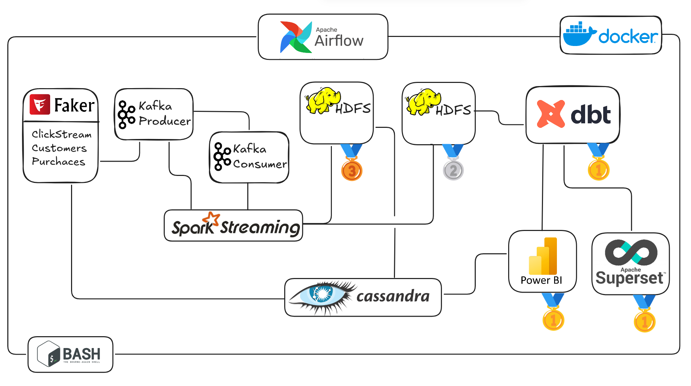
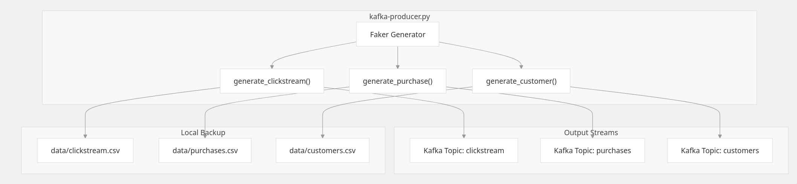
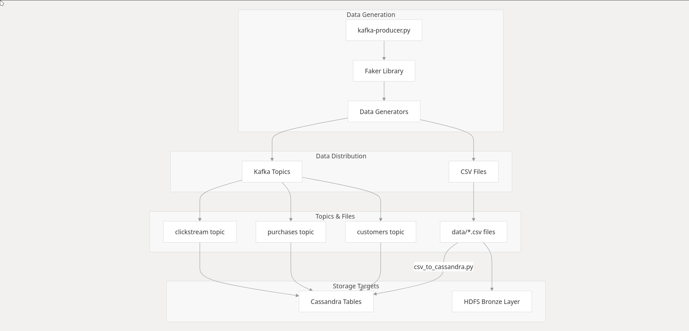
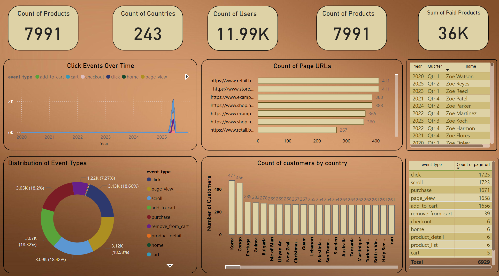
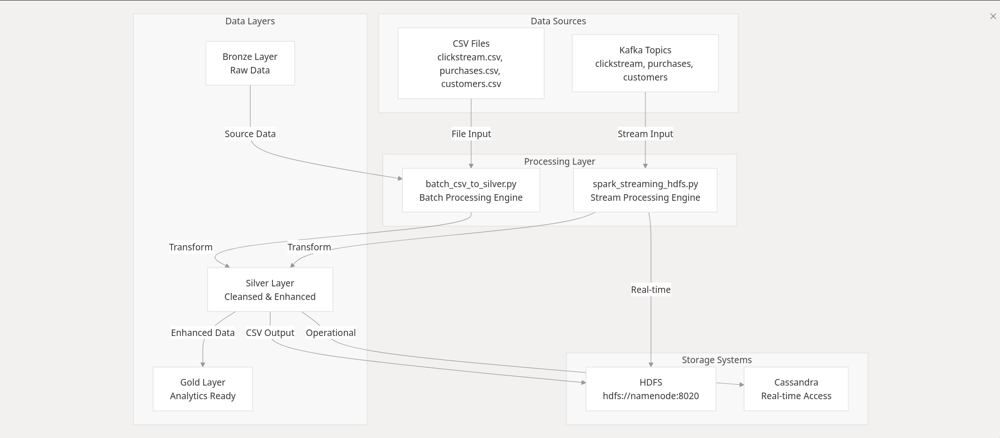
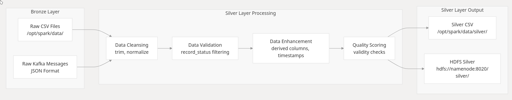
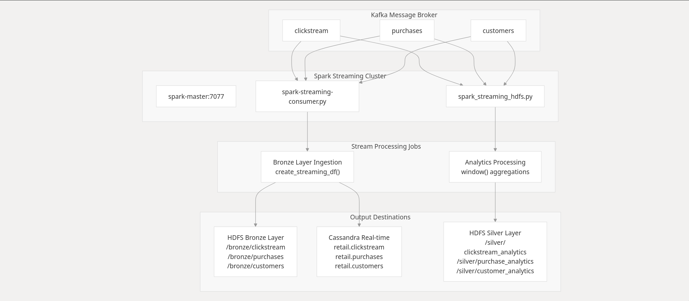

# Real-Time Retail Analytics Pipeline

## Overview

A comprehensive real-time data engineering solution that processes retail data streams using modern big data technologies. This project implements a medallion architecture (Bronze → Silver → Gold) to transform raw retail data into actionable business insights through automated data pipelines.

## Architecture

## Data Flow

The system follows a layered data architecture with real-time and batch processing capabilities:

```
Data Sources → Kafka → Bronze Layer (HDFS) → Silver Layer (HDFS/Cassandra) → Gold Layer (Analytics)
     ↓              ↓           ↓                    ↓                           ↓
CSV Files    Real-time    Raw Data         Cleaned Data              Business Metrics
Streaming    Ingestion    Storage          Validation                Aggregations
```

### Technology Stack

| Component | Technology | Purpose |
|-----------|------------|---------|
| **Message Streaming** | Apache Kafka | Real-time data ingestion and event streaming |
| **Data Processing** | Apache Spark | Distributed data processing and transformations |
| **Storage** | Apache Hadoop (HDFS) | Distributed file system for data lake |
| **Database** | Apache Cassandra | NoSQL database for real-time analytics |
| **Orchestration** | Apache Airflow | Workflow automation and scheduling |
| **Transformation** | dbt (Data Build Tool) | SQL-based data modeling and transformations |
| **Visualization** | Apache Superset | Business intelligence and dashboards |
| **Containerization** | Docker & Docker Compose | Infrastructure deployment and management |

## Data Pipeline Architecture

### Bronze Layer (Raw Data Ingestion)
- **Purpose**: Capture and store raw data from multiple sources
- **Technologies**: Kafka, HDFS, Spark Streaming
- **Data Sources**:
  - Customer registration data
  - Purchase transactions
  - Website clickstream events
- **Storage Format**: Parquet files in HDFS
- **Processing**: Real-time streaming with 30-second micro-batches


#### PowerBI Bronze Visualization

### Silver Layer (Data Cleaning and Validation)
- **Purpose**: Clean, validate, and standardize data for analytics
- **Technologies**: Spark, Cassandra, HDFS
- **Transformations**:
  - Data quality validation
  - Schema standardization
  - Duplicate removal
  - Data type conversions
- **Storage**: Both HDFS (batch) and Cassandra (real-time access)
- **Quality Checks**: Null value handling, format validation,  business rule enforcement





#### Stream consumers


### Gold Layer (Analytics and Business Intelligence)
- **Purpose**: Create business-ready datasets and metrics
- **Technologies**: dbt, DuckDB, Superset
- **Outputs**:
  - Customer dimension tables
  - Purchase fact tables
  - Daily sales summaries
  - Customer segmentation
- **Analytics**: Revenue trends, customer behavior, product performance

## Data Sources and Flow

### Data Sources
The pipeline processes three main data streams:

1. **Customer Data**
   - Customer registration information
   - Demographics and contact details
   - Account creation timestamps
   - Email validation and domain extraction

2. **Purchase Data**
   - Transaction records with order details
   - Product information and pricing
   - Quantity and payment information
   - Temporal purchase patterns

3. **Clickstream Data**
   - Website navigation events
   - User interaction patterns (clicks, scrolls, page views)
   - Session tracking and user journey mapping
   - Product engagement analytics

### Data Flow Architecture

#### Real-time Processing Path
1. **Data Generation**: Kafka producer generates synthetic retail events
2. **Stream Ingestion**: Kafka topics receive real-time data streams
3. **Stream Processing**: Spark Streaming processes data in 30-second micro-batches
4. **Bronze Storage**: Raw data persisted in HDFS Parquet format
5. **Silver Processing**: Data cleaning, validation, and quality checks
6. **Cassandra Storage**: Real-time access layer for operational analytics
7. **Gold Analytics**: Business metrics and aggregated KPIs

#### Batch Processing Path
1. **CSV Ingestion**: Batch files loaded to HDFS bronze layer
2. **Spark Processing**: Large-scale data transformations and cleaning
3. **Silver Layer**: Validated and standardized datasets
4. **dbt Transformations**: SQL-based business logic and modeling
5. **Gold Layer**: Analytics-ready dimensional tables and fact tables

## Usage Guide

### Service Access Points

Once the infrastructure is running, access the following services:

| Service | URL | Credentials |
|---------|-----|-------------|
| **Airflow Web UI** | http://localhost:8081 | admin/admin |
| **Spark Master UI** | http://localhost:8080 | N/A |
| **HDFS NameNode UI** | http://localhost:9870 | N/A |
| **Superset Dashboard** | http://localhost:8088 | admin/admin |
| **Kafka** | localhost:29092 | N/A |
| **Cassandra** | localhost:9042 | cassandra/cassandra |
| **PostgreSQL** | localhost:5432 | airflow/airflow |

### Pipeline Execution Options

#### Option 1: Automated End-to-End Pipeline (Recommended)

Execute the complete pipeline using Airflow orchestration:

```bash
# Trigger the enhanced retail analytics pipeline
docker exec realtime-retail-analytics-kafka-spark-dbt-airflow-airflow-1 \
  airflow dags trigger enhanced_retail_analytics_pipeline
```

This automated pipeline includes:
- Bronze layer data ingestion from CSV files
- Silver layer data processing and validation
- Real-time Kafka streaming and processing
- Gold layer dbt transformations
- Comprehensive data quality validation

### Data Validation and Monitoring

#### Verify Data Processing
```bash
# Check silver layer data
ls -la data/silver/*/part*.csv | head -3

# Verify gold layer outputs
ls -la data/gold/*.csv

# Check data quality
head -5 data/silver/customers/part-*.csv
```

#### Monitor Pipeline Health
```bash
# Check Airflow DAG status
docker exec realtime-retail-analytics-kafka-spark-dbt-airflow-airflow-1 \
  airflow dags list

# View recent task runs
docker exec realtime-retail-analytics-kafka-spark-dbt-airflow-airflow-1 \
  airflow tasks list enhanced_retail_analytics_pipeline
```

#### Real-time Monitoring
```bash
# Monitor Kafka topics
docker exec kafka-tools kafka-topics --bootstrap-server kafka-iot:9092 --list

# Check Cassandra data
docker exec cassandra-iot cqlsh -e "SELECT COUNT(*) FROM retail.clickstream;"

# Monitor Spark jobs
# Access Spark UI at http://localhost:8080
```

## Data Models and Analytics

### Silver Layer Data Models

#### Customers Table
- **customer_id**: Unique customer identifier
- **name**: Customer full name
- **email**: Validated email address
- **email_domain**: Extracted email domain for analysis
- **country**: Customer location
- **signup_date**: Account creation timestamp

#### Purchases Table
- **order_id**: Unique transaction identifier
- **customer_id**: Foreign key to customers
- **product_id**: Product identifier
- **quantity**: Items purchased
- **price**: Unit price
- **total_amount**: Calculated total (quantity × price)
- **purchase_date**: Transaction timestamp

#### Clickstream Table
- **user_id**: Session user identifier
- **session_id**: Unique session identifier
- **page_url**: Visited page URL
- **event_type**: Action type (page_view, click, scroll, add_to_cart, purchase)
- **product_id**: Associated product (if applicable)
- **timestamp**: Event occurrence time

### Gold Layer Analytics

#### Customer Dimension (dim_customers)
- Customer demographics and profile information
- Purchase behavior metrics (total orders, total spent, average order value)
- Customer segmentation (No Purchases, One-time, Regular, Frequent)
- First and last purchase dates

#### Purchase Facts (fct_purchases)
- Detailed transaction records with enriched customer information
- Temporal dimensions (year, month, day, hour)
- Revenue calculations and metrics

#### Daily Sales Summary (daily_sales_summary)
- Aggregated daily sales metrics
- Customer acquisition and retention metrics
- Product performance indicators
- Revenue trends and patterns

## Performance and Scalability

### System Performance
- **Real-time Latency**: Sub-minute processing for streaming data
- **Batch Processing**: Efficient handling of large datasets
- **Throughput**: Processes thousands of records per second
- **Storage Optimization**: Parquet format for efficient compression and query performance

### Scalability Features
- **Horizontal Scaling**: Add Spark workers for increased processing capacity
- **Data Partitioning**: Temporal and categorical partitioning for optimized queries
- **Resource Management**: Configurable memory and CPU allocation
- **Load Balancing**: Distributed processing across cluster nodes

