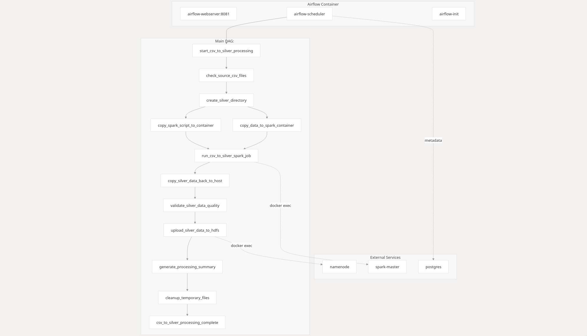
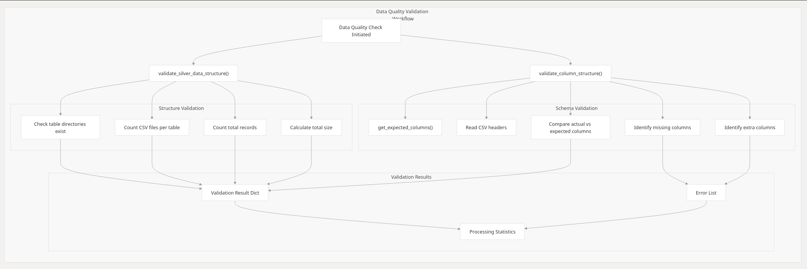

# Airflow DAGs - Retail Analytics Pipeline

This directory contains Airflow DAGs for orchestrating the retail analytics data pipeline.

## Available DAGs

### Core Pipeline DAGs

**`bronze_ingest_to_hdfs.py`**
- Handles three datasets: clickstream, purchases, and customers.
- Appends data to HDFS if file exists, else creates and copies it.
- Requires proper mounting of local files and HDFS access in Airflow.

**`dbt_transformation_dag`**
- Automates DBT transformations on silver-layer data to produce gold-layer analytics tables.  
- Validates input data availability and performs quality checks post-transformation.  
- Scheduled to run every 2 minutes for fast testing and feedback loops.  
- Includes a summary report generation after successful DBT execution.


**`csv_to_silver_pipeline.py`** - CSV to Silver layer processing
- Cleans and validates raw CSV data using Spark
- Applies data quality checks and transformations
- Outputs clean data to silver layer
- Schedule: Daily at midnight



**`load_csvs_to_hdfs.py`** - Bronze layer data ingestion
- Loads raw CSV files to HDFS bronze layer
- Handles file validation and error checking
- Prepares data for downstream processing


### Supporting DAGs

**`bronze_ingest_to_hdfs.py`** - Bronze layer ingestion
- Ingests raw data streams to HDFS bronze layer
- Handles real-time data from Kafka topics

**`dbt_transformations_dag.py`** - Gold layer transformations
- Executes dbt models for business logic
- Creates dimension and fact tables
- Generates aggregated analytics

**`silver_data_monitor.py`** - Data quality monitoring
- Monitors silver layer data freshness and quality
- Generates data quality reports
- Schedule: Every 6 hours

**`retail_pipeline.py`** - Legacy pipeline (deprecated)
- Original pipeline implementation
- Kept for reference

### Utilities

**`dag_utils.py`** - Common utilities and helper functions
- Shared functions across DAGs
- Configuration management
- Error handling utilities



## Usage

### Trigger DAGs via Airflow UI
1. Access Airflow at http://localhost:8081
2. Login with admin/admin
3. Enable and trigger desired DAGs

### Trigger DAGs via CLI
```bash
# Trigger main pipeline
docker exec airflow-container airflow dags trigger enhanced_retail_analytics_pipeline

# Trigger CSV processing
docker exec airflow-container airflow dags trigger csv_to_silver_pipeline
```

## Monitoring

- **Airflow UI**: http://localhost:8081 - DAG status and logs
- **Task Dependencies**: View task relationships and execution order
- **Data Quality**: Monitor via silver_data_monitor DAG
- **Error Handling**: Check task logs for detailed error information