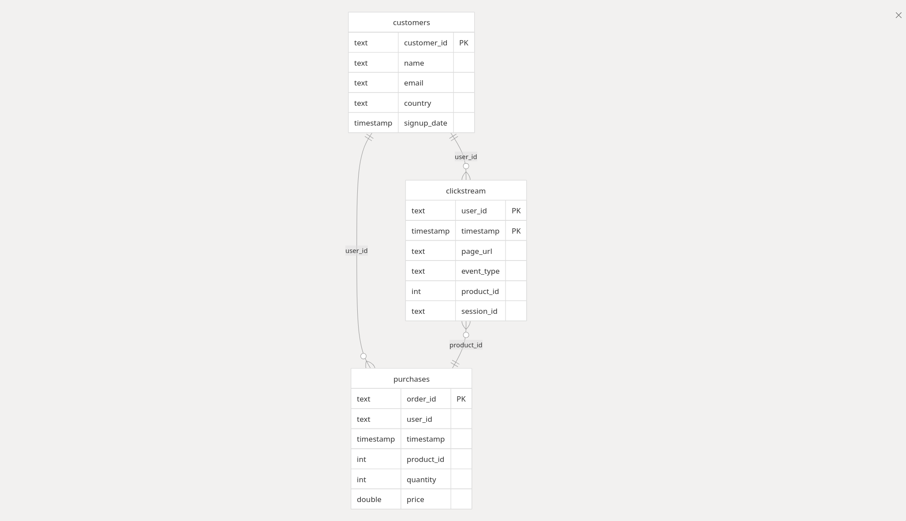

# Data Directory - Medallion Architecture

This directory implements a medallion architecture with three distinct data layers: Bronze, Silver, and Gold.

## Architecture Overview

```
Raw Data → Bronze Layer → Silver Layer → Gold Layer → Analytics
  CSV/Kafka   Raw Storage   Clean Data   Business Ready   Dashboards
```


## Data Layers

### Bronze Layer (Raw Data Ingestion)
**Purpose**: Store raw, unprocessed data as received from sources

**Location**: HDFS (`hdfs://namenode:8020/bronze/`), Local (`data/namenode/`, `data/datanode/`)

**Sources**: Kafka streams (`clickstream`, `purchases`, `customers`), CSV files

**Format**: Parquet files, no schema validation, long-term retention

### Silver Layer (Cleaned and Validated Data)
**Purpose**: Clean, validate, and standardize data for analytics

**Location**: HDFS (`hdfs://namenode:8020/silver/`), Local (`data/silver/`), Cassandra (`retail` keyspace)

**Transformations**: Data quality checks, deduplication, type conversion, standardization

**Structure**:
```
silver/
├── customers/          # Customer master data
├── purchases/          # Transaction records
└── clickstream/        # Website interaction events
```

### Gold Layer (Analytics-Ready Data)
**Purpose**: Business-ready datasets optimized for reporting

**Location**: `data/gold/`

**Data Models**:
- **`dim_customers.csv`**: Customer dimension with segmentation and behavior metrics
- **`fct_purchases.csv`**: Purchase facts with temporal dimensions and revenue calculations
- **`daily_sales_summary.csv`**: Daily aggregated business metrics
- **`superset_data.db`**: SQLite database for visualization
- **`export_summary.txt`**: Export metadata and statistics

## Data Flow Process

### 1. Data Ingestion (Bronze) 🥉
```bash
# Real-time streaming
Kafka Producer → Kafka Topics → Spark Streaming → Bronze Layer (HDFS)

# Batch processing
CSV Files → Airflow DAG → Bronze Layer (HDFS)
```

### 2. Data Processing (Silver) 🥈
```bash
# Data cleaning and validation
Bronze Layer → Spark Processing → Data Quality Checks → Silver Layer
                                                      ↓
                                               Cassandra (Real-time)
```

### 3. Data Analytics (Gold) 🥇
```bash
# Business transformations
Silver Layer → dbt Models → Gold Layer → Business Intelligence
                              ↓
                         Superset/Analytics
```

## Storage Systems

### HDFS (Hadoop Distributed File System)
- **Purpose**: Scalable distributed storage for Bronze and Silver layers
- **Location**: `data/namenode/` and `data/datanode/`
- **Access**: `hdfs://namenode:8020/`

### Cassandra
- **Purpose**: Real-time access to Silver layer data
- **Schema**: `data/cassandra/` and `data/schema.cql`
- **Tables**: `retail.customers`, `retail.purchases`, `retail.clickstream`

### Local File System
- **Purpose**: Gold layer analytics and development data
- **Format**: CSV files for easy access and portability
- **Integration**: Direct access for Superset and other BI tools

## Data Quality and Monitoring

### Validation Rules
- **Customers**: Email format validation, non-null names
- **Purchases**: Positive quantities and prices, valid customer references
- **Clickstream**: Valid URLs, timestamp consistency

### Monitoring
- **Data Freshness**: Automated checks for recent data updates
- **Volume Monitoring**: Track record counts and data growth
- **Quality Metrics**: Validation failure rates and data completeness
- **Pipeline Health**: Airflow DAG monitoring and alerting

## Usage Examples

### Access Silver Data
```bash
# View silver layer data
head -5 data/silver/customers/part-*.csv
ls -la data/silver/*/

# Query Cassandra
docker exec cassandra-iot cqlsh -e "SELECT COUNT(*) FROM retail.customers;"
```

### Access Gold Data
```bash
# View analytics data
head -5 data/gold/dim_customers.csv
cat data/gold/export_summary.txt

# SQLite queries
sqlite3 data/gold/superset_data.db "SELECT customer_segment, COUNT(*) FROM dim_customers GROUP BY customer_segment;"
```

### Data Refresh
```bash
# Refresh entire pipeline
docker exec airflow-container airflow dags trigger enhanced_retail_analytics_pipeline

# Refresh specific layers
docker exec airflow-container airflow dags trigger csv_to_silver_pipeline
docker exec airflow-container airflow dags trigger dbt_transformations_dag
```